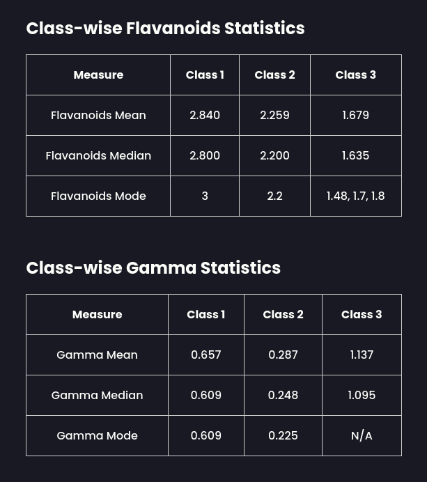

## Getting Started

These instructions will get you a copy of the project up and running on your local machine for development and testing purposes.

### Installing Dependencies

```bash
yarn install
```

### Running the App

```bash
yarn start
```

### Available Scripts

- yarn start: Starts the development server.
- yarn build: Builds the app for production.
- yarn test: Launches the test runner.
- yarn eject: Ejects the app from Create React App configuration.

### Built With

- React - JavaScript framework
- Create React App - Tool for creating React apps
- Yarn - Package manager

### App Snapshot


